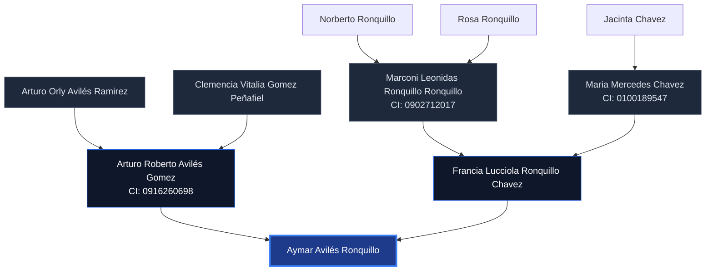

# Árbol Genealógico de la Familia Avilés Ronquillo

Aquí tienes el árbol genealógico estructurado con la información obtenida a través de las consultas del Registro Civil.

---

## Detalles de las Fichas del Registro Civil

### 1. Generación de Padres

#### Padre: **Arturo Roberto Avilés Gomez**
* **Cédula:** `0916260698`
* **Fecha de Nacimiento:** `1972-04-12`
* **Lugar de Nacimiento:** Guayas / Milagro / Milagro
* **Padre:** Arturo Orly Avilés Ramirez (Abuelo Paterno)
* **Madre:** Clemencia Vitalia Gomez Peñafiel (Abuela Paterna)

#### Madre: **Francia Lucciola Ronquillo Chavez**
* **Padre:** Marconi Leonidas Ronquillo Ronquillo (Abuelo Materno)
* **Madre:** Maria Mercedes Chavez (Abuela Materna)

---

### 2. Generación de Abuelos

#### Abuelo Materno: **Marconi Leonidas Ronquillo Ronquillo**
* **Cédula:** `0902712017`
* **Padre:** Norberto Ronquillo (Bisabuelo Materno)
* **Madre:** Rosa Ronquillo (Bisabuela Materna)

#### Abuela Materna: **Maria Mercedes Chavez**
* **Cédula:** `0100189547`
* **Madre:** Jacinta Chavez (Bisabuela Materna)
* **Padre:** *No registrado / No disponible*
